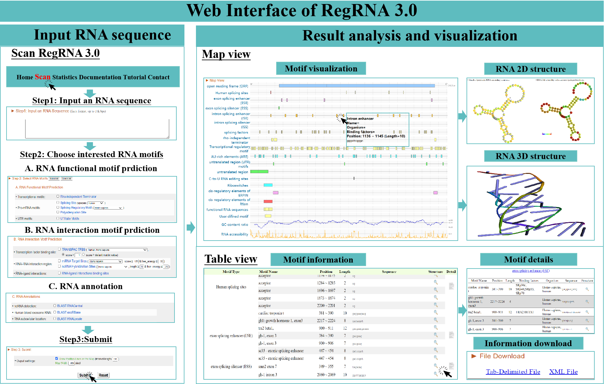

# RegRNA 3.0: Expanding Regulatory RNA Analysis with New Features for Motif, Interaction, and Annotation

RegRNA 3.0 is a powerful meta-server and computational workflow designed for the identification and analysis of regulatory RNA motifs, interactions, and annotations. It integrates **26 specialized algorithms** and automated data retrieval from **28 databases** to provide accurate and customizable RNA analysis. This version introduces advanced features such as RNA 3D structure prediction, non-coding RNA (ncRNA) detection, RNA modification analysis, and interaction prediction, making it a versatile tool for researchers in RNA biology and functional genomics.

**Access RegRNA 3.0 at**: [http://awi.cuhk.edu.cn/~RegRNA](http://awi.cuhk.edu.cn/~RegRNA)

---

## Table of Contents
- [Key Features](#key-features)
- [Integrated Tools and Databases](#integrated-tools-and-databases)
  - [RNA Functional Motif Prediction](#rna-functional-motif-prediction)
  - [RNA Interaction Motif Prediction](#rna-interaction-motif-prediction)
  - [RNA Annotation Modules](#rna-annotation-modules)
- [User Interface and Workflow](#user-interface-and-workflow)
- [Installation and Usage](#installation-and-usage)
- [Citation](#citation)
- [Data Availability](#data-availability)
- [Contact](#contact)

---

## Key Features
- **RNA Functional Motif Prediction**: Identify splice sites, riboswitches, AU-rich elements, G-quadruplexes, and more.
- **RNA Interaction Analysis**: Predict miRNA targets, RNA-protein interactions, RNA-ligand binding, and transcription factor binding sites.
- **Comprehensive RNA Annotation**: Classify RNA families, predict subcellular localization, identify RNA modifications, and predict 3D structures.
- **Enhanced Visualization**: Interactive maps, tables, and structural diagrams for intuitive result interpretation.
- **User-Friendly Interface**: Streamlined workflow with parallel processing and customizable parameters.

---

## Directory Structure and Tools

### RNA_Motif/
RNA motif analysis tools for identifying various regulatory elements and structural motifs in RNA sequences.

- **Splicing Related**
  - `GeneSplicer/`: Splice site prediction
  - `SpliceAid_F/`: Splicing factor binding site identification

- **Regulatory Elements**
  - `RiboSW/`: Riboswitch detection
  - `ElemeNT/`: Core promoter element prediction
  - `AREDsite2_ARED_plus/`: AU-rich element identification
  - `ARED_Patterns/`: AU-rich element pattern matching

- **RNA Processing**
  - `polya_svm_2.2/`: Polyadenylation site prediction
  - `RBSfinder/`: Ribosome binding site detection
  - `transterm_hp_v2.09/`: Rho-independent terminator prediction

- **Structure and Motif**
  - `G4Hunter/`: G-quadruplex prediction
  - `UTRsite_PatSearch/`: UTR motif search
  - `erpin4.2.5.server/`: RNA motif search using profiles
  - `infernal-1.1.4/`: RNA family and structure annotation
  - `rnamotif-3.0.7/`: RNA motif pattern matching

### RNA_Interaction/
Tools for predicting RNA interactions with various molecules.

- `RNALigands/`: RNA-ligand interaction prediction
- `BRIO/`: RNA-protein binding site prediction
- `miranda/`: miRNA target prediction
- `match/`: Transcription factor binding site prediction

### RNA_annotation/
Tools for RNA annotation and structural analysis.

- `RhoFold/`: RNA 3D structure prediction
- `Modomics_Decoder/`: RNA modification site analysis

---

## Environment Setup

RegRNA 3.0 requires several dependencies. Here are the main requirements:

### Core Dependencies
- Python 3.8
- PyTorch 1.11.0 (CUDA 10.2)
- CUDA Toolkit 10.2
- TensorFlow 2.7.0

### Key Python Packages
- numpy==1.23.0
- scipy==1.8.1
- pandas==1.2.5
- biopython==1.78
- matplotlib==3.7.2
- tqdm==4.66.5

### Bioinformatics Tools
- ViennaRNA 2.4.7
- TransTermHP 2.09
- BLAST

### Installation
You can set up the environment using conda:

```bash
conda env create -f regrna_environment.yml
conda activate regrna
```


---

## Integrated Tools and Databases

### RNA Functional Motif Prediction
RegRNA 3.0 integrates a wide range of tools and databases for identifying functional RNA motifs:
- **Splicing Sites**: GeneSplicer ([1](#references)).
- **Polyadenylation Sites**: polya_svm ([2](#references)).
- **Ribosome Binding Sites**: RBSfinder ([3](#references)).
- **Rho-Independent Terminators**: TransTermHP ([4](#references)).
- **AU-Rich Elements**: ARED-Plus ([5](#references)) and ARESite2 ([6](#references)).
- **Riboswitches**: Ribocentre-switch ([7](#references)), RiboSW ([8](#references)), and Rfam ([9](#references)).
- **Core Promoter Elements**: ElemeNT2023 ([10](#references)).
- **RNA Decay**: RNAdegformer ([11](#references)) and OpenVaccine dataset ([12](#references)).
- **G-Quadruplexes**: QUADRatlas ([13](#references)) and G4 Hunter ([14](#references)).

### RNA Interaction Motif Prediction
RegRNA 3.0 supports the prediction of RNA interactions with other molecules:
- **miRNA Targets**: miRanda ([15](#references)) with miRBase ([16](#references)) and miRTarBase ([17](#references)).
- **ncRNA Hybridization Sites**: BLAST ([18](#references)) and RNAcofold ([19](#references)).
- **Transcription Factor Binding**: TRANSFAC ([20](#references)) and Match ([21](#references)).
- **RNA-Ligand Interactions**: RNALigand ([22](#references)) with PDB ([23](#references)), R-BIND ([24](#references)), and Inforna ([25](#references)).
- **RNA-Binding Proteins**: BRIO ([26](#references)).

### RNA Annotation Modules
RegRNA 3.0 provides comprehensive annotation tools for RNA sequences:
- **RNA Families**: RNAcentral ([27](#references)) and eRNABase ([28](#references)).
- **Blood Exosome RNAs**: exoRBase 2.0 ([29](#references)).
- **Subcellular Localization**: RNALocate 3.0 ([30](#references)).
- **A-to-I RNA Editing**: REDIportal 2.0 ([31](#references)).
- **RNA Modifications**: RMVar 2.0 ([32](#references)) and MODOMICS ([33](#references)).
- **RNA 3D Structures**: RhoFold ([34](#references)).
- **Secondary Structures**: RNAfold ([19](#references)), e-RNA ([35](#references)), and KnotFold ([36](#references)).

---

## Tool Usage Guide

### RNA_Motif Tools

#### Splicing Analysis
```bash
# GeneSplicer - Splice site prediction
cd RNA_Motif/GeneSplicer
./genesplicer input.fasta -f human > output.txt

# SpliceAid_F - Splicing factor binding sites
cd RNA_Motif/SpliceAid_F
./spliceaid_f input.fa > output.txt
```

#### Regulatory Elements
```bash
# RiboSW - Riboswitch detection
cd RNA_Motif/RiboSW
./ribosw -i input.fasta -o output.txt

# ElemeNT - Core promoter elements
cd RNA_Motif/ElemeNT
python3 element.py -i input.fasta -o output.txt

# ARED/AREDsite2 - AU-rich elements
cd RNA_Motif/AREDsite2_ARED_plus
./ared_search input.fasta > output.txt
```

#### RNA Processing
```bash
# polya_svm - Polyadenylation sites
cd RNA_Motif/polya_svm_2.2
./polya_svm.pl input.fasta > output.txt

# RBSfinder - Ribosome binding sites
cd RNA_Motif/RBSfinder
./rbsfinder -i input.fasta -o output.txt

# TransTermHP - Terminators
cd RNA_Motif/transterm_hp_v2.09
./transterm --all-context -p expterm.dat input.fasta
```

#### Structure and Motif
```bash
# G4Hunter - G-quadruplex prediction
cd RNA_Motif/G4Hunter
python3 g4hunter.py -i input.fasta -o output.txt

# UTRsite search
cd RNA_Motif/UTRsite_PatSearch
./patsearch -f input.fasta -p pattern.txt > output.txt

# ERPIN - RNA motif search
cd RNA_Motif/erpin4.2.5.server
./erpin -S training.epn input.fasta > output.txt

# Infernal - RNA family annotation
cd RNA_Motif/infernal-1.1.4
cmscan Rfam.cm input.fasta > output.txt
```

### RNA_Interaction Tools
```bash
# RNALigands - RNA-ligand interactions
cd RNA_Interaction/RNALigands
./rnaligands -i input.fasta -o output.txt

# BRIO - RNA-protein binding
cd RNA_Interaction/BRIO
python3 brio.py -i input.fasta -o output.txt

# miRanda - miRNA target prediction
cd RNA_Interaction/miranda
./miranda miRNA.fa input.fa -out output.txt

# MATCH - TFBS prediction
cd RNA_Interaction/match
./match -f input.fasta -m matrices.dat > output.txt
```

### RNA_annotation Tools
```bash
# RhoFold - 3D structure prediction
cd RNA_annotation/RhoFold
python3 rhofold.py --input input.fasta --output output_dir

# Modomics Decoder
cd RNA_annotation/Modomics_Decoder
python3 modomics_decoder.py input.fasta > output.txt
```

### Notes:
- Replace `input.fasta` with your input file name
- Output formats vary between tools, check individual tool documentation for details
- Some tools may require specific input file formats or additional parameters
- All paths are relative to the RegRNA3.0 installation directory

---

## User Interface and Workflow
RegRNA 3.0 offers a user-friendly interface with the following key components:
1. **Input Section**: Submit RNA sequences in FASTA format (manual entry or file upload).
2. **Analysis Modules**:
   - **Functional Motifs**: Select from 17 tools to analyze splicing, decay, and regulatory elements.
   - **Interaction Motifs**: Predict miRNA targets, RNA-protein interactions, and more.
   - **Annotation**: Classify RNA families, predict localization, and identify modifications.
3. **Results Visualization**:
   - **Map View**: Interactive motif maps with positional annotations.
   - **Table View**: Detailed tables of predicted motifs and their properties.
   - **Structure Displays**: 2D and 3D RNA structure visualizations (forward/reverse orientation).
4. **Export Options**: Download results in tab-delimited or XML formats.


*Figure 1: RegRNA 3.0 workflow integrating data resources, prediction tools, and visualization modules.*

---

## Installation and Usage
RegRNA 3.0 is a web-based tool and does not require installation. Simply visit the web server and follow these steps:
1. Go to [http://awi.cuhk.edu.cn/~RegRNA](http://awi.cuhk.edu.cn/~RegRNA).
2. Input your RNA sequence in FASTA format or upload a file.
3. Select the desired analysis modules and configure parameters.
4. Submit the job and view the results in the interactive interface.

---

## Citation
If you use RegRNA 3.0 in your research, please cite:  
DOI: [to be published].

---

## Contact
For technical support or inquiries, please contact:  
Dr. Hsi-Yuan Huang  
2F, Research Building B, The Chinese University of Hong Kong, Shenzhen.  
Email: huanghsiyuan@cuhk.edu.cn

---

## References
1. Pertea, M., Lin, X. and Salzberg, S.L. (2001) GeneSplicer: a new computational method for splice site prediction. *Nucleic Acids Research*, **29**, 1185-1190.
2. Cheng, Y., Miura, R.M. and Tian, B. (2006) Prediction of mRNA polyadenylation sites by support vector machine. *Bioinformatics*, **22**, 2320-2325.
3. Suzek, B.E., Ermolaeva, M.D., Schreiber, M. and Salzberg, S.L. (2001) A probabilistic method for identifying start codons in bacterial genomes. *Bioinformatics*, **17**, 1123-1130.
4. Kingsford, C.L., Ayanbule, K. and Salzberg, S.L. (2007) Rapid, accurate, computational discovery of Rho-independent transcription terminators illuminates their relationship to DNA uptake. *Genome Biology*, **8**, 1-12.
5. Bakheet, T., Hitti, E. and Khabar, K.S.A. (2018) ARED-Plus: an updated and expanded database of AU-rich element-containing mRNAs and pre-mRNAs. *Nucleic Acids Research*, **46**, D218-D220.
6. Fallmann, J., Sedlyarov, V., Tanzer, A., Kovarik, P. and Hofacker, I.L. (2016) AREsite2: an enhanced database for the comprehensive investigation of AU/GU/U-rich elements. *Nucleic Acids Research*, **44**, D90-D95.
7. Bu, F., Lin, X., Liao, W., Lu, Z., He, Y., Luo, Y., Peng, X., Li, M., Huang, Y. and Chen, X. (2024) Ribocentre-switch: a database of riboswitches. *Nucleic Acids Research*, **52**, D265-D272.
8. Chang, T.-H., Huang, H.-D., Wu, L.-C., Yeh, C.-T., Liu, B.-J. and Horng, J.-T. (2009) Computational identification of riboswitches based on RNA conserved functional sequences and conformations. *RNA*, **15**, 1426-1430.
9. Ontiveros-Palacios, N., Cooke, E., Nawrocki, E.P., Triebel, S., Marz, M., Rivas, E., Griffiths-Jones, S., Petrov, A.I., Bateman, A. and Sweeney, B. (2024) Rfam 15: RNA families database in 2025. *Nucleic Acids Research*, gkae1023.
10. Adato, O., Sloutskin, A., Komemi, H., Brabb, I., Duttke, S., Bucher, P., Unger, R. and Juven-Gershon, T. (2024) ElemeNT 2023: an enhanced tool for detection and curation of core promoter elements. *Bioinformatics*, **40**, btae110.
11. He, S., Gao, B., Sabnis, R., and Sun, Q. (2023). RNAdegformer: accurate prediction of mRNA degradation at nucleotide resolution with deep learning. *Briefings in bioinformatics*, **24**, bbac581.
12. Wayment-Steele, H.K., Kladwang, W., Watkins, A.M., Kim, D.S., Tunguz, B., Reade, W., Demkin, M., Romano, J., Wellington-Oguri, R. and Nicol, J.J. (2022) Deep learning models for predicting RNA degradation via dual crowdsourcing. *Nature Machine Intelligence*, **4**, 1174-1184.
13. Bourdon, S., Herviou, P., Dumas, L., Destefanis, E., Zen, A., Cammas, A., Millevoi, S. and Dassi, E. (2023) QUADRatlas: the RNA G-quadruplex and RG4-binding proteins database. *Nucleic Acids Research*, **51**, D240-D247.
14. Brázda, V., Kolomazník, J., Lýsek, J., Bartas, M., Fojta, M., Šťastný, J., and Mergny, J.-L. (2019). G4Hunter web application: a web server for G-quadruplex prediction. *Bioinformatics*, **35**, 3493-3495.
15. John, B., Enright, A.J., Aravin, A., Tuschl, T., Sander, C., and Marks, D.S. (2004). Human microRNA targets. *PLoS biology*, **2**, e363.
16. Kozomara, A., Birgaoanu, M. and Griffiths-Jones, S. (2019) miRBase: from microRNA sequences to function. *Nucleic Acids Research*, **47**, D155-D162.
17. Cui, S., Yu, S., Huang, H.-Y., Lin, Y.-C.-D., Huang, Y., Zhang, B., Xiao, J., Zuo, H., Wang, J. and Li, Z. (2024) miRTarBase 2025: updates to the collection of experimentally validated microRNA--target interactions. *Nucleic Acids Research*, gkae1072.
18. Altschul, S.F., Gish, W., Miller, W., Myers, E.W., and Lipman, D.J. (1990). Basic local alignment search tool. *Journal of molecular biology*, **215**, 403-410.
19. Bernhart, S.H., Tafer, H., Mückstein, U., Flamm, C., Stadler, P.F., and Hofacker, I.L. (2006). Partition function and base pairing probabilities of RNA heterodimers. *Algorithms for Molecular Biology*, **1**, 1-10.
20. Matys, V., Kel-Margoulis, O.V., Fricke, E., Liebich, I., Land, S., Barre-Dirrie, A., Reuter, I., Chekmenev, D., Krull, M. and Hornischer, K. (2006) TRANSFAC® and its module TRANSCompel®: transcriptional gene regulation in eukaryotes. *Nucleic Acids Research*, **34**, D108-D110.
21. Kel, A.E., Gossling, E., Reuter, I., Cheremushkin, E., Kel-Margoulis, O.V., and Wingender, E. (2003). MATCHTM: a tool for searching transcription factor binding sites in DNA sequences. *Nucleic acids research*, **31**, 3576-3579.
22. Sun, S., Yang, J., and Zhang, Z. (2022). RNALigands: a database and web server for RNA–ligand interactions. *RNA*, **28**, 115-122.
23. Burley, S.K., Berman, H.M., Kleywegt, G.J., Markley, J.L., Nakamura, H. and Velankar, S. (2017) Protein Data Bank (PDB): the single global macromolecular structure archive. *Protein Crystallography: Methods and Protocols*, 627-641.
24. Donlic, A., Swanson, E.G., Chiu, L.-Y., Wicks, S.L., Juru, A.U., Cai, Z., Kassam, K., Laudeman, C., Sanaba, B.G. and Sugarman, A. (2022) R-BIND 2.0: an updated database of bioactive RNA-targeting small molecules and associated RNA secondary structures. *ACS Chemical Biology*, **17**, 1556-1566.
25. Disney, M.D., Winkelsas, A.M., Velagapudi, S.P., Southern, M., Fallahi, M. and Childs-Disney, J.L. (2016) Inforna 2.0: a platform for the sequence-based design of small molecules targeting structured RNAs. *ACS Chemical Biology*, **11**, 1720-1728.
26. Guarracino, A., Pepe, G., Ballesio, F., Adinolfi, M., Pietrosanto, M., Sangiovanni, E., Vitale, I., Ausiello, G. and Helmer-Citterich, M. (2021) BRIO: a web server for RNA sequence and structure motif scan. *Nucleic Acids Research*, **49**, W67-W71.
27. (2021) RNAcentral 2021: secondary structure integration, improved sequence search and new member databases. *Nucleic Acids Research*, **49**, D212-D220.
28. Song, C., Zhang, G., Mu, X., Feng, C., Zhang, Q., Song, S., Zhang, Y., Yin, M., Zhang, H. and Tang, H. (2024) eRNAbase: a comprehensive database for decoding the regulatory eRNAs in human and mouse. *Nucleic Acids Research*, **52**, D81-D91.
29. Lai, H., Li, Y., Zhang, H., Hu, J., Liao, J., Su, Y., Li, Q., Chen, B., Li, C. and Wang, Z. (2022) exoRBase 2.0: an atlas of mRNA, lncRNA and circRNA in extracellular vesicles from human biofluids. *Nucleic Acids Research*, **50**, D118-D128.
30. Wu, L., Wang, L., Hu, S., Tang, G., Chen, J., Yi, Y., Xie, H., Lin, J., Wang, M. and Wang, D. (2024) RNALocate v3.0: Advancing the Repository of RNA Subcellular Localization with Dynamic Analysis and Prediction. *Nucleic Acids Research*, gkae872.
31. Mansi, L., Tangaro, M.A., Lo Giudice, C., Flati, T., Kopel, E., Schaffer, A.A., Castrignanò, T., Chillemi, G., Pesole, G. and Picardi, E. (2021) REDIportal: millions of novel A-to-I RNA editing events from thousands of RNAseq experiments. *Nucleic Acids Research*, **49**, D1012-D1019.
32. Huang, Y., Zhang, L., Mu, W., Zheng, M., Bao, X., Li, H., Luo, X., Ren, J. and Zuo, Z. (2024) RMVar 2.0: an updated database of functional variants in RNA modifications. *Nucleic Acids Research*, gkae924.
33. Cappannini, A., Ray, A., Purta, E., Mukherjee, S., Boccaletto, P., Moafinejad, S.N., Lechner, A., Barchet, C., Klaholz, B.P., and Stefaniak, F. (2024). MODOMICS: a database of RNA modifications and related information. 2023 update. *Nucleic acids research*, **52**, D239-D244.
34. Shen, T., Hu, Z., Sun, S., Liu, D., Wong, F., Wang, J., Chen, J., Wang, Y., Hong, L., and Xiao, J. (2024). Accurate RNA 3D structure prediction using a language model-based deep learning approach. *Nature methods*, 1-12.
35. Tsybulskyi, V., Semenchenko, E., and Meyer, I.M. (2023). e-RNA: a collection of web-servers for the prediction and visualisation of RNA secondary structure and their functional features. *Nucleic acids research*, **51**, W160-W167.
36. Gong, T., Ju, F., and Bu, D. (2024). Accurate prediction of RNA secondary structure including pseudoknots through solving minimum-cost flow with learned potentials. *Communications biology*, **7**, 297.